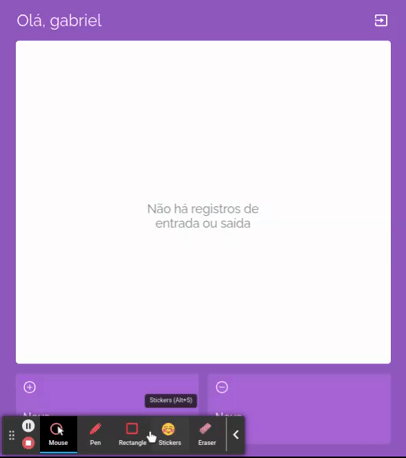

# Descrição:
O MyWallet é uma página web projetada para ajudar os usuários a controlar suas despesas e ganhos de maneira simples e conveniente. Com um design amigável e fácil de usar, esta plataforma oferece as seguintes funcionalidades:

 - Cadastro de Usuário: Os usuários podem se cadastrar facilmente, criando uma conta com informações básicas, como nome de usuário e senha.

- Registro de Despesas e Ganhos: Após o login, os usuários podem registrar suas despesas e ganhos de forma rápida e organizada. Eles podem categorizar cada transação, adicionando uma descrição, valor e data.

- Visão Geral do Fluxo de Caixa: Os usuários têm acesso a uma visão geral do seu fluxo de caixa, que exibe o saldo atual com base nas transações registradas. Isso permite que eles acompanhem o saldo disponível em tempo real.

- Gerenciamento de Transações: Os usuários têm a capacidade de editar ou excluir transações a qualquer momento. Isso permite que eles façam correções ou removam dados desnecessários.

<p align="center">
  
</p>

# Tecnologias: 
O MyWallet é uma aplicativo FullStack, caso queira acessar o repositorio do Front clique <a href="https://github.com/gabriel-victor933/projeto14-mywallet-back">aqui</a>. As principais tecnologias utilizadas foram: 

### FrontEnd: 
 - React; 
 - Styled-components;
 - React-Router-Dom

 ### BackEnd: 
 - NodeJs;
 - Express;
 - Mongodb;


 # Como rodar: 
 - Clone os repositórios do Front e do Back
 - Instale as dependências usando `npm i`;
 - Instale o MongoDb. Clique <a href="https://www.mongodb.com/docs/manual/installation/">aqui</a> para acessar o guia oficial.
 - No repositório do back crie um arquivo `.env` e insira as seguintes variaveis.
 ```bash
 DATABASE_URI = "mongodb://localhost:27017/MyWallet"
 PORT = 5000
 ```
 - No Front crie um arquivo `.env` e insira as seguintes variaveis.
 ```bash
 REACT_APP_API_URL = http://localhost:5000
 ```
- Inicie o servidor do mongo usando o seguinte comando no terminal: `mongod --dbpath ~/.mongo`
- Rode o backEnd da aplicação usando `npm run dev`;
- Rode o FrontEnd usando `npm run start`

